# Imprint

The source text and artwork in this ebook are believed to be in the United States public domain; that is, they are believed to be free of copyright restrictions in the United States. They may still be copyrighted in other countries, so users located outside of the United States must check their local laws before using this ebook. The creators of, and contributors to, this ebook dedicate their contributions to the worldwide public domain via the terms in the [CC0 1.0 Universal Public Domain Dedication](https://creativecommons.org/publicdomain/zero/1.0/). For full license information, see the Uncopyright at the end of this ebook.

# Acknowledgments

Based on a comic series about Wuffle, the Big Nice Wolf by Piti Yindee.

Written by Leonard Kirke.
Editing and Proofreading by K.C.

Illustrations by Wing Yuda.

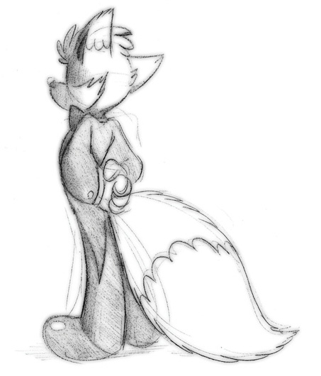

I want to think Piti for giving me the opportunity to write this story, and I hope Wuffle enjoy seeing the big nice in a new medium. I can’t thank Piti for all the support he’s given me.

I want to thank my friend K.C. for doing an excellent job editing and proofreading.

Lastly, thanks to for creating such a beautiful illustrations.

~ Leo Kirke

# Chapter 1

“Five more minutes…” the young fox whined, pulling the covers hover his head. The sunlight had burst through his window, yanking him away from his sleep, as the shades were drawn with that familiar unwelcome swishing noise.

“There’s no time to delay, young master,” replied the enormous polar bear, “you have an appointment within the hour. You set aside the entire day for it. Besides, you’ve already slept in quite late. It’s past noon.”

“Can’t it wait…?” Foxo mumbled, now burying his head underneath a pillow to block out the voice of his butler. Before Joe had drawn the shades, Foxxo had been having a real fun dream that he’d already forgotten. He did his best to try to remember. It seemed like it might have involved a pool with some gold coins…

“I do believe this is a particularly important meeting. You wrote down in the schedule that it involves negotiations for the watermill.”

“That’s nice… let me just… let me just rest a bit, so I’m prepared for… I need make sure I have lots of energy…before I have to deal with….”

Suddenly, Foxxo jumped out of bed.

“THE MILL!?!” He cried. “That’s today!?”

“According to your schedule…”

“AHHH! Where’s my suit!? Everything has to be perfect!” Foxxo, draped in pajamas, rushed to his closet and began hastily examining different outfits, looking for just the right one.

Joe, behind him, picked up a suit he’d selected the night before and cleared his throat.

“That’s it, just the right one! Thank you, Joe!” A hint of a smile crept across Joe’s face for a moment.

“Very good, young master. I’ll go downstairs and prepare your breakfast while you dress.”

As his butler closed the door behind him, Foxxo began grooming like his life depended on it. While he finished up his morning routine, he made sure not to wrinkle his suit, and that every hair on his head was combed perfectly in its place. When he was satisfied, he headed downstairs to late breakfast, though he was nervous than hungry.

“How time is left?” Foxxo asked nervously, sitting at the kitchen table, staring down at a half-eaten pancake.

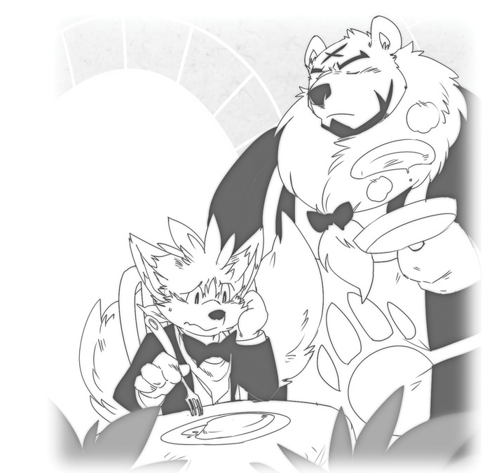

“According to your schedule, young master,” Joe replied while flipping a pancake for himself, “your appointment isn’t due for another fifteen minutes.”

“Fifteen minutes… only fifteen minutes…hey, Joe, is my hair okay?”

Setting the skillet back down onto the stove, Joe reached into his pocket for a magnifying glass and examined the top of Foxxo’s head.

“It looks perfect,” Joe said after a thorough scalp examination, “I do not see a single stray hair.”

“And my suit? Is it clean? I didn’t get any orange juice or syrup on it, did I? And I don’t want to repeat my mistake from a few weeks ago, leaving a leaky fountain pen in my shirt pocket…”

Foxxo nervously nibbled on a piece of toast.

“Your suit is fine, young master,” Joe said reassuringly.

“Thank you, Joe,” Foxxo smiled. His friends were supportive, but no one could give him confidence like Joe.

“It’s all in the line of duty, sir,” Joe replied casually, as he picked up the now-empty dish covered in toast crumbs and brought it to the sink.

“I mean it! I don’t know what I’d do without you…”

“I’m certain you would do quite well, master Foxxo.”

“I wouldn’t have woken up in time for my appointment, that’s for sure.”

Foxxo stared out the kitchen window, trying to calm his nerves. Joe signed.

“You underestimate yourself. True, there’s still much to be learned. But you don’t give yourself enough credit. You are capable of much more than you know.”

“I hope you’re right. Especially today…”

“Might I inquire as to what exactly why you’re so anxious?” Joe had found the nudging Foxxo to talk about his problem often helped to relax him a bit.

“This is really a big deal,” Foxxo replied. “No, this is THE big deal. Remember that town meeting last month?”

“Ah, yes, I do seem to recall… you sent me to prepare pastries for all the villagers while you a poke with them about your watermill idea.”

“That’s the one! I stumbled onto a really unique business opportunity. At one of the holiday parties I attended with my parents last winter. I heard about the owner of a brick factory who was interested in investing in Gingerbread Village. It gave me an idea…I thought maybe he could provide bricks, maybe even other building materials, in return for owning a share in the business. It would save the village, and me, a lot of money, and the watermill will be great for everyone.”

“Did the villagers agree?”

“Not at first,” Foxxo lazily examine a huge chunk of pancake dripping with syrup, “that’s what the town meeting was for.”

“I take it you did a good job convincing them, then?”

“Oh, yes yes yes!” Foxxo beamed. “It was one of my finest hours as a salesman! Everyone was concerned that the mill would cause Gingerbread Village to turn into a Gingerbread City over night. No one wants to lose our sense of community here.”

“Of course not, young master,” Joe, dousing his plate pancake in syrup, raised a suspicious eyebrow at his young friend.

“I explained to them that, according to the plans I’d drawn up, the watermill would be built on the river in the forest. The forest wouldn’t be harmed, of course!” Foxxo added quickly, noticing the hint of disapproval in Joe’s eyes. “The whole design is very nature-friendly. And being built just outside the village limits will keep everything just the same. Nobody will have to change anything, or have their current businesses disrupted. I don’t want to repeat the mail incident…”

Foxxo shuddered.

“That’s quite reassuring.”

“The villagers thought so too! By the end of my presentation, they all voted unanimously to approve the construction of the mill. As long as the village maintains an equal, majority in the business, they’re all for it.”

“A majority share in the business?” Joe sounded surprised.

“Well, after me, of course. But after all…I’m part of the village too,” Foxxo grinned slyly.

“Certainly, young master…”

“My friends even gave me some good luck charms, for my book meeting with the owner of the brick company today! Take a look in the basket over the counter.”

Joe approached the basket Foxxo had pointed to and opened it. Inside, he found a plate with a waffle on it, and the smiling face of Wuffle was drawn in maple syrup. Next to it was a fresh fish wrapped in paper, with a note in Pui Pui’s handwriting said, “Don’t mess it up, you spoiled fox!” Next to that was a huge carrot, Debbita’s favorite good luck charm. There were cookies from Mr.s Hazel’s family a piece of chocolate from Matilda, a loaf of bread from Dr. Greyham and Chuck, and a candy statue of some video game character from Aunty Pinky.

“They certainly do support your efforts, young master.”

“Of course! After all, the watermill will double production of the village’s most important resources. The bakery will be able to make twice as much with the extra flour, and that means twice as many donuts, which made Debbita especially happy,” Foxxo eagerly explained. “But I’m still nervous…from what I’ve heard, the owner of this brick company is a tough negotiator. His whole is supposed to be tough. All three run competing businesses! You’d have to be tough to compete with your own family like that.”

“It would make family dinners rather awkward, I imagine,” Joe mused.

“I met one of the two sisters, and, well…to be honest, she kinda…scared me.” His ears drooped with embarrassment. “I’m glad I’m not negotiating with her, at least, other to arrange a shipment of wood for the water wheel.”

“The sister’s business produces timber, and her brother’s company produces bricks?”

“Yeah… like I said, they’re very competitive.”

“Curious.”

“Even though I don’t have to deal with her, I’m still a nervous wreck…” Foxxo sighed. “This is my first real solo business negation. There’s so much at stake today!”

“I’m certain that you’ll do fine, sir. No one in Gingerbread Village is half the businessman you are, and your parents will be very proud, too.”

“Th-thank you again, Joe.” If it was anybody else, Foxxo would have taken the compliment in stride. But somehow, hearing it from Joe made him feel almost embarrassed as flattered. “I’m really glad you’ll be here with me…”

Joe’s confidence meant more to him than he would to admit.

# Chapter 2

“Hey, it’s been almost fifteen minutes, hasn’t it? Why isn’t he here yet?”

“You still have five minutes to wait, sir.”

Foxxo’s nervous frown returned.

“Well, that… that’s… that is SO unprofessional!” Foxxo’s usual blustery personality had returned. Joe was all to familiar with this; it was Foxxo’s way of getting psyched up for a big task. “You should ALWAYS arrive early for an important me-“

Before he could continue his rant about business etiquette, Foxxo’s ears perked up at the sound of an approaching car. He stuck his out the window, and his face went pale. Down the street, a large limousine was heading towards his mansion.

“HE’S HERE!” he shouted, and rushed to the mirror to make sure that his hair was still neatly combed, and that his bow-tie was still perfectly straight. “Do I look okay, Joe?”

“You look fine, young master,” Joe said with a sigh, “just as you did ten minutes ago.”

“Everything has to be perfect! This will be the most important business deal I’ve made since I opened the bakery…maybe most important one I’ve ever made!”

Joe suppressed another smile. He could a time when all Foxxo worried about was sharing his toys. Now he was carrying the weight of the whole village on his shoulders. In many way, though, Joe knew that Foxx was still a child.

Outside they could hear the door of the limousine slam. Foxxo rushed downstairs, waiting at the door, and Joe followed at his usual, steady pace. Flinging open the door, Foxxo stepped out onto the front steps and raised his hand in greeting. He was having a hard time maintaining his professional, business-like composure while his stomach felt like it was full of butterflies. Joe appeared behind him and placed a reassuring hand on his shoulder.

The limousine’s driver, a stone-faced chameleon in a black business suit, had already run to the back of the door for her employer. Shielding his eyes from the midday sunlight, Foxxo tried to see figure sitting inside the car, but found the interior shrouded in darkness. The driver, standing next to open door, saluted and began to speak in a loud, royal tone of voice which startled some neighbors walking by.

“Presenting… the honorable General K. Bacon!”

Usually the calmest person of the village, Joe suddenly flinched, his eyes becoming wide. It wasn’t his custom to bother with details of Foxxo’s meeting; his job was simply to give reminders of appointment and schedule changes. This time, however, he wished he’d asked more about the details of this particular meeting, and who exactly Foxxo was going to meet.

“It can’t be…” he whispered to himself as he slowly backed up towards the door. “Young master, I’m afraid I must…” Foxxo, however, was too awestruck to hear him.

Foxxo’s eyes grew wide, too, at the imposing figure that slowly emerged from the car. General Bacon was nearly as big as Joel! Dressed in a perfectly pressed uniform that could barely contain his muscles, and revealing a slight, reserved smile, the gigantic boar leaned down to shake Foxxo’s hand. Foxxo felt the very small standing next to him, even more he usually did standing next to Joe.

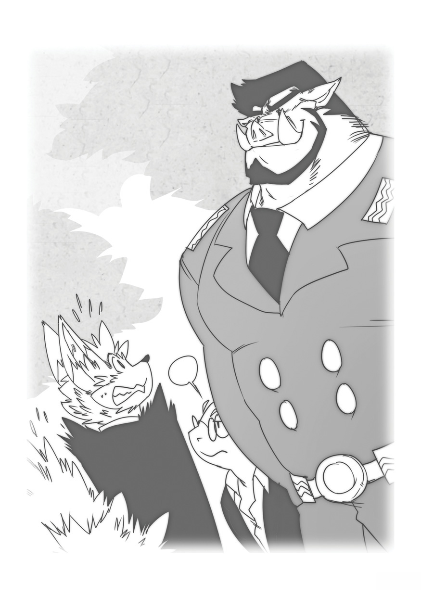

“P-p-pleased to meet you, General…”

“pleased to meet you as well, Mr. Foxxo.”

“And this is my butler, Jo…oh?” Foxxo was startled to realize that Joe was no longer standing behind him. He looked all around and saw no trace of his loyal butler.

“WHAT!? Where’s Joe!? He knows I can’t face a negation all alone!” The thoughts came rushing out of Foxxo’s mind as panic quickly set in.

“Is there a problem, Mr. Foxxo?” asked General Bacon.

“I…no, not exactly, it’s just…I seem to have misplaced my butler…”

“Perhaps that note on the door will offer some explanation.

Foxxo turned around saw exactly what General was talking about. It was a small note, written in Joe’s handwriting and with his usual stationary, pinned to the front door the house. Foxxo the paper and read it as quickly he could, hoping for something reassuring.

“Dear Young Master,

I’ve decided to take a day off. I’m certain that you’ll handle this situation with good judgment. I trust you’ve learned to do the right thing. I have full confidence in you.

Sincerely,
Joe”

Foxxo stared at the note, his face frozen in shock.

“A DAY OFF!?” Foxxo shouted in disbelief. “Joe hasn’t taken off in… in… forever! Can he even do that?”

He turned the note over and found something written on the back.

“Dear Young Master,

Please be aware that I’m allotted ten days of vacation per year, and fifteen days off in case of sickness, as specified in my contrast. So yes, I can do this. Please write down in my official record that I have used one of thirty vacations days accumulated over the last three years.

Sincerely,
Joe”

Foxxo slapped himself in the face. Sometimes, he thought, Joe was too organized for his own good.

# Chapter 3

“So, Mr. Foxxo may we go inside and discuss the terms of our deal?” The words of General Bacon snapped Foxxo back to the present.

“Oh, no problem, it’s just… my butler had to…take care of something. Nothing to worry about! Right this way, sir…” Foxxo motioned towards his mansion. The General raised a skeptical eyebrow towards Foxxo, who looked nervously up at him, and then followed his gaze back to the closed door. The driver, standing behind the General, made a quiet, disapproving “tsk tsk” sound as her eyes roved around the mansion, inspecting everything.

“Oh, sorry, let me get that for you…” the young added apologetically. He was so used Joe getting for him that he didn’t even think about opening it himself.

Once inside, the General surveyed the perfectly maintained sitting room.

“I must say, you do an excellent job keeping house, young fellow,” the boar mused.

“Thank you! I do try to keep things looking clean and neat.” As he spoke, Foxxo couldn’t help but recall more times than he could count when he’d made some huge mess that Joe had cleaned up. Not having Joe with him, would totally throw off his concentration during the meeting, he realized. He had to be at his best if he was going to negotiate a deal that would benefit Gingerbread Village, not to mention his own bank account.

_“What a great time for Joe to take a vacation…”_ Foxxo grumbled to himself.

“Wilhelmina,” the General spoke to his assistant, the chameleon who had driven the limousine, “fetch the building plans.”

“Roger, sir!” came the excited reply. Foxxo couldn’t help but reminded of the voice of a solider being called to attention.

Just as quickly as she called, Wilhelmina followed Foxxo and General Bacon inside, carrying a huge black briefcase. She sat it down upon Foxxo’s coffee table and opened it. She picked up a folder filled and handed them to the General.

“Shall we begin discussing the building plans, then?”

“Oh, sure thing! I mean…um, certainly.”

“I say, Mr. Foxxo, would it be great bother if I troubled you for some refreshments? A glass of chilled grape would be fine for me, and Wilhelmina here prefers cola, if you have any. Oh, and I would love to sample a pastry or two from the famous Gingerbread Bakery of yours.”

“I…uh…yes, just a…just a moment…” Foxxo’s face went pale. He had no idea where Joe stored any of the food. Feeling totally lost, he hurried into the kitchen and began searching. For once, he wished he didn’t have so much stuff, and such a big house…it made finding anything nearly impossible. Joe, of course, had his own organizational system…which Foxxo had never bothered to learn.

He opened one cupboard and found nothing but different kinds of crackers. He tried another, only to see a huge selection of neatly labeled spices. In the refrigerator, there were so many fancy imported bottles, jugs, and cups full of different drink that it made his head spin. Desperately, he searched the labels, only to realize their names were written in other languages, and Joe had used only code words to mark each one.

It didn’t take Foxxo long to realize he had very little hope of figuring this out and conducting the negotiations at the same time. Without Joe, he was lost. At the very least, he thought, he needed some kind of back up, someone dependable, and that’s when he had an idea…

Rushing to the huge, ornate telephone, Foxxo began looking through the address list Joe kept next to it. Lucky for him, the names on the list weren’t written in any kind of code, it was arranged alphabetically.

“Why couldn’t he have organized everything like this…?” he muttered to himself as he found the correct number and began dialing. Soon, a familiar voice was speaking on the other end of the line.

“Hello?”

“Pui Pui! I need to talk to Wuffle!”

“Well, well, well! What have you done to earn a phone from His Royal Majesty, eh?” asked the hedgehog.

“No time for jokes! I need Wuffle”

“I don’t think Wuffle would want to chat with someone who’s so rude…” Pui Pui spoke with a yawn. “You didn’t even use the Magic Word!”

Foxxo felt like a steam was about to shoot from his ears.

“Fine… Pui Pui, may I PLEASE speak to Wuffle!?” he asked through a gritted teeth.

“Well, since you asked so politely, why not?” Pui Pui chuckled, handing the phone to his friend.

Soon, the welcome voice of Wuffle was on the line.

“Hello? Foxxo? What’s up? Is the big meeting going okay? Everyone in town is talking about it!”

“Wuffle, this is an emergency! I need your help!”

“Oh no!” Wuffle spoke with sudden concern. “What happened!?”

“I need you to be my butler today!”

There was a pause.

“You need me to do WHAT!?” Wuffle couldn’t believe what he heard.

“Joe took the day off without warning me first, and now the General is here, and he wants refreshments, and I can’t negotiate and serve food all at once, and I don’t where Joe stores any of the food, and the General is going to be offended, and the deal’s going to fall through, and every is going to -“

“slow down, Foxxo! I don’t know anything about being a butler, but I wouldn’t leave you hanging!”

“So you’ll do it!?”

“Sure! Just for today, though!” Wuffle didn’t want this to be a regular arrangement.

“Thank you! Now get here as soon as you can!”

# Chapter 4

“You’re wel-“ but before Wuffle could finish, Foxxo had already hung up.

He ran to Joe’s wardrobe closet and began to eagerly searching for a particular outfit. Of course, nearly all of Joe’s clothes were identical, but Foxxo knew that was at least one particular outfit that would be of use today.

“Aha! Here it is! It’s perfect! I knew saving this would come in handy…”

“EXUSE ME!” boomed the voice of General Bacon. Foxxo rushed back to the sitting room to find the General looking a bit less calm than before, and Wilhelmina appeared even more disapproving.

“Yes, sir?”

“I don’t mean to trouble you, young man,” the General’s voice was restrained, yet there was a hint of irritation in it that wasn’t well-hidden, “but exactly how long does it take to prepare a few snacks?”

“Oh, I’m…terribly sorry, sir. My usual butler had to leave unexpectedly for…personal reasons. My other servant should be here in just a moment.”

“One would hope so,” said the General, “as it doesn’t inspired much confidence in a business leader who can’t manage his own household.”

“I can assure you, General, this is just a minor setback, we can get back to discussing your proposal over refreshments in just a few minutes. Any moment now…”

Suddenly, there was a rapid knocking at the door.

“There he is! Just a moment, sir!”

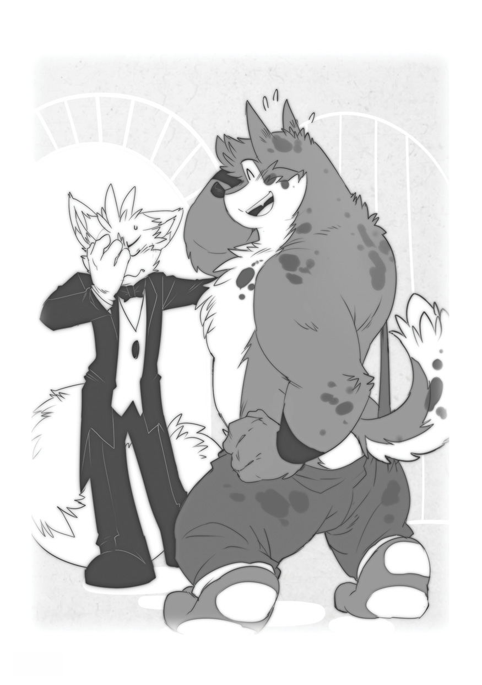

Foxxo rushed back down the hall, to the front door. Flinging it open, his hopeful smile quickly turned into a frown of disappointment.

“Wuffle, what were you thinking!?” he wailed.

“What?”

“Just look at you!”

Wuffle looked down. There was patches of dirt all over his body, bits of grass were lodged in his fur, and brairs stuck to his worn-out overalls.

“I can’t have a butler that looks like this! It look you just finished working on a farm!”

“Um…I did just finish working on a farm.”

Foxxo slapped himself in the face again.

“Why didn’t you clean off first?”

“You told me to come over here as soon I could…”

Foxxo sighed.

“Fine, fine, just hurry upstairs and clean yourself up a bit in one of the guest rooms. I’ll bring you a suit.”

“Oh, sure, Foxxo…”

Wuffle stood there for a moment, looking confused.

“Um, which way? I can never figure out where anything is in your house, it’s so big…”

“Great…a butler that doesn’t know his way around the house. What could possibly go wrong?”

Foxxo led Wuffle to one of the guest rooms upstairs. While Wuffle was busy cleaning up in the washroom, Foxxo remembered the suit, and rushed back downstairs to bring it to his new, temporary butler. As he approached the wardrobe closet, he could a hear loud “HARUMPH!” as the General was clearing his throat. Briefly he popped back into the sitting room.

“Just a moment more, General!” The General stared at him, saying nothing, but looking decidedly less patient than before. Wilhelmina mirrored her employer’s mood, and was surveying the room with a shifty, suspicious look in her eyes.

Foxxo grabbed the suit and brought it back upstairs, only to find Wuffle, wearing a towel and grinning sheepishly, his fur puffed out, looking like a giant ball of fluff.

“What?”

“I think I…over-did it a little, using your electric hair dryer. I’m not used to all these high-tech gadgets…”

Foxxo slapped himself in the face again.

“Never mind. Just get the suit on, the General is waiting.

Foxxo went back out into the hall and shut the door. After a moment, he heard Wuffle’s voice calling out to him, but it sounded as if was having some trouble breathing.

“Foxxo… I’ve got a little trouble… problem…”

He opened the door and looked inside, and there was Wuffle, wearing the suit. The problem, Foxxo could see at once, was the outfit was about two sizes too small for the big wolf. It seemed like might rip at any moment. In the back, his fluff tail was poking through the top of the trousers, and he struggled to curl it back down into place like a tightly wound spring.

“Don’t you… have anything… bigger?” Wuffle asked, in between gasps for air.

“I’m sorry, Wuffle, but that’s the only suit I have close to your size. Joe’s suits are way too big for you. That one was shrunk in the wash. Joe was… trying to teach me to do laundry one day…” Foxxo’s cheeks reddened with embarrassment. “Anyway, I didn’t want it to go to waste so I kept around just in case someone needed it. And that someone is you!”

“Okay… I’ll… try to wear it… just for today.”

“Excellent. Now, your first job is to bring refreshment. I need to go begin negotiations with the General, so head to the kitchen and prepare the food. The General wants chilled grape, Wilhelmina, his assistant, wants soda. Oh, and bring the General two pastries from the bakery.”

Wuffle began counting out the item on his fingers, trying to keep it all straight.

“Don’t tell me you can’t manage just a few simple snacks!”

“I’m sorry, Foxxo! I’m just not used to all this butler stuff. I’m not Joe.”

“No,” Foxxo said with a sigh, “you’re not Joe. But you are here, so let’s make this work.” He slapped his hands together. “Chop chop!”

# Chapter 5

Jumping to the attention, Wuffle ran downstairs to the kitchen, and Foxxo, running after him, headed for the sitting room. Eager to not waste another moment, Foxxo all but dived back onto his chair, and face the irritated General with what he hoped was a calm, nonchalant smile. He didn’t want to show any weakness during a negotiation, and he’d already lost too much of his composure.

“My apologies, once again, General. My butler will be here with snacks in no time.”

“I certainly hope so. Now, let’s get down to business.”

“Yes, please, I’d like to look over the updated plans you’ve prepared, based on my proposal.”

The General arranged the varies documents Wilhelmina had retrieved from the briefcase so that all of them were visible at once. There were building permits, estimated costs of building materials, and contracts to sign. Foxxo, using all of his business training to the best of his ability, studied each document carefully. Though he wasn’t an expert when it came thing like doing laundry, fishing, and growing tomatoes, Foxxo could certainly hold his own when it came to business deals. He took his time, scrutinizing every details.

“This all looks to be in good order. I would like to discuss the major points of our deal, if you don’t mind.”

“By all means.”

“The mill will be built outside of the village, in the forest, to avoid disrupting the normal activities of the villagers, correct? The villagers at the town meeting were very adamant about this.”

“You’re correct, Mr. Foxxo.”

“Good. Now, the townspeople have asked, in exchange for granting permission to have the mill built, for a 25 percent stake in the business. You agree to this?”

“It seems quite fair to me.”

“In turn, for providing your building services and bricks, you’ll get another 25 percent stake. Is this acceptable?”

“Actually, Mr. Foxxo, it appears that out initial estimates were a bit low…”

“Oh?” Foxxo raised an eyebrow.

“Yes. You see, considering the costs of transportation, couple with the expenses of producing the bricks, in order to make this arrangement profitable for my company, I believe 40 percent stake would be required…” The General’s voice was cool, stead, and very self-assured. But Foxxo had prepared for this. He couldn’t let himself be intimidated.

“General, as you know, I have great respect for you, and for your company…”

“Most reassuring…”

“However, surely you must be aware that giving up a 40 percent stake would be impossible. The villagers would not be happy with anyone who doesn’t actually live here having a greater stake in the business.”

“This doesn’t apply to you, then, Mr. Foxxo?” The Generally didn’t look happy, though this, came as no surprise.

“Sir, I may be a private business owner, but I’m also a citizen of the Gingerbread Village.”

“I see.”

The General glared at Foxxo, and Foxxo glared back. Neither of them wanted to back down.

“It would seem we’ve come to an impasse, then.”

“The best I could do,” Foxxo spoke cautiously, “is to offer you 30 percent.”

“That would be acceptable,” Foxxo began to breathe a sign of relief before the General continued, “if you fund the building yourself. I can still offer you the bricks but I’m afraid 30 percent cut wouldn’t cover the costs of construction.”

Foxxo winced. The whole was supposed to save the town the expenses of having the mill built…not to mention save himself from funding it. If he had to use his own money, he’d look like a weak negotiator…and he couldn’t allow the General to own a greater stake in the new business than the townspeople, ether. The that would mean paying more out of his own pocket and giving up at least 5 percent of his own share, to make up the difference to the village. He needed time to think. Normally, Joe would provide him with some sort of distraction and time to gather his thoughts. But Joe wasn’t here this time…

# Chapter 6

Just then, the meeting was interrupted by an odd steady shuffling sound. All three of them looked towards the kitchen. The sound got closer, and closer and finally the kitchen door opened and Wuffle wobbled into the room. The tight was causing him to walk like a robot, and the fabric was rubbing together each time he took an awkward step, producing the shuffling noise. Wuffle was carefully a couple of Gingerbread Bakery donuts on a plate, and two glasses in the other.

“Here’s your snacks!” the big wolf announced cheerfully. He sat the plate down in front of the General, right on top of the one page of the building contrast, and as he bent over the table the collar of his shirt popped out and smacked Wilhelmina in the face with a loud WHACK!

“I’m sorry, let me get that! he apologized and reached for the collar stuck on Wilhelmina’s nose, but she grabbed his wrist as it got near face.

“NO,” she commanded, suddenly giving Wuffle that made his skin crawl. Her grip was like a vice. “I will get it,” she added, and the calmly removed the collar and placed it in Wuffle’s hand.

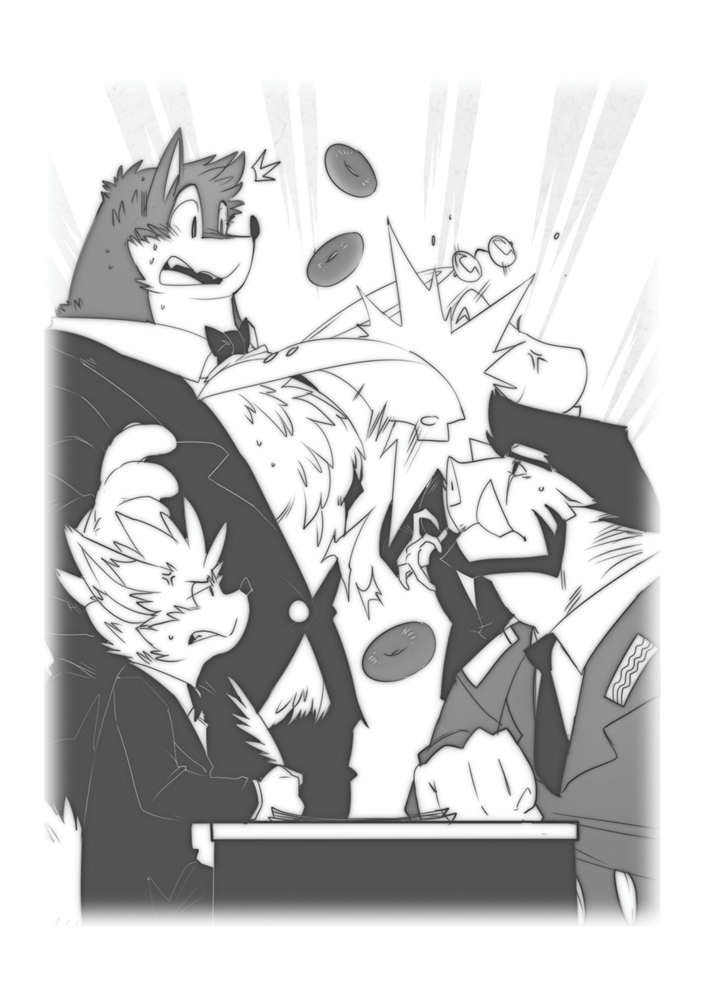
“Um… um, thank you,” he stammered, not sure what else to say.

“Be more careful next time.” She continued to glare, as if looking right through him. Wuffle tried to shake off his terror and get back to work. He plopped down the drinks, and nearly spilled them.

“Oh, I almost forgot!” he exclaimed as he reached into his jacket pocket. “Here’s a cookie for you, Foxxo. I didn’t want you go hungry. Sorry this isn’t a plate, I couldn’t carry it all.”

Wuffle smiled sheepishly as Foxxo gave him an angry stare.

“You butler addressed you by your first name?” the General mused. “How very… informal.”

“He’s, uh… new.”

Foxxo felt like was losing even more ground in this negation.

“General, Miss Wilhelmina, enjoy your refreshment and please excuse me. Wuffle, may I speak with you for a moment.”

“Sure!”

“I mean ALONE!” Foxxo spoke as he dragged Wuffle back to the kitchen.

“Please return soon,” the General called after them, “I really MUST insist that we finish our discussion presentably.”

“Certainly, General!” Foxxo called back. Once inside the kitchen, he slammed the door behind him.

“Okay, first of all, why the heck did you call me Foxxo out there?!”

“Um… because that’s your name. I always call you Foxxo…”

“A butler doesn’t refer to his employer by his first name! Call me ‘master’ or ‘sir,’ not just plain old Foxxo!”

“But I’m not really your butler…” Wuffle spoke apologetically, “that feels too weird. Can’t I just call you Foxxo?”

“Ugh, fine… can you call me Mister Foxxo, at least?”

“Okay, Foxxo. Uh, I mean… Mister Foxxo. Do I have to call you that whole time the General’s here? Maybe I could try avoid calling you anything; I could try to be silent like Joe. How about I…”

“Great, now YOU’RE trying to out-negotiate me too!” Foxxo pressed his face against the wall.

“Negotiate…? I wasn’t trying to… I just meant that…”

Foxxo began quietly slamming his head against the wall.

“What’s wrong? Isn’t the meeting going well?” Wuffle was quick to be concerned for his friend.

“He wants a 40 precent stake in the business.”

Wuffle eyes bugged out.

“40 PERCENT? But that’s almost double the town’s stake! That’s almost as much as your own stake!”

“I KNOW! Of course I know… but he’s only one that can offer us a deal like this. He owns one of the highest quality brick manufactures around, and giving him a stake, we’d be getting the mill built for practically nothing. But I already promised the villager that the mill would always be as much theirs as anyone else’s. Well, except for me, course…”

“Didn’t you try to, you know, convince him? Isn’t that what you’re supposed to do in business?”

“I offered him 30 percent, but he said that would only cover the bricks, not the construction costs… so I’d have to pay for those myself. And I’d have to give up 5 percent of my share to the village, to make it all event.”

“That’s not too bad…”

“Maybe not, but I can’t give up even one of my shares!”

Wuffle frowned.

“But Foxxo, you still be the majority owner! You’re already in charge of the major business in Gingerbread Village, giving up 5 percent of this watermill business isn’t going to do you any harm. Besides, you promised the villagers they’d be equal shareholders after you. I know you, Foxxo, and you’re not nearly as greedy as Pui Pui says. You care about your friends.”

“But I am greedy! I have to be! I give up even a little, it’ll make me look weak… in front of my family, in front of friends… in front of…” Foxxo stuck out of his tongue in disgust, “in front of Pui Pui.”

“Gee, Foxxo, I don’t think anyone will think you’re weak… they’ll just think you’re doing what’s best for Gingerbread Village. I know it’s a tough decision, but everyone is counting on you to make tough decision like this, to do the right for everybody.

Foxxo sighed, feelingless. He wasn’t sure that he was the right person for the job anymore. How, he wondered, could be any good in business if he froze up in an important meeting like this? Try as he might to improvise, he was out of ideas.

“I don’t know, Wuffle. Maybe I’m not cut out for this kind of work after all. Maybe I should try to be a farmer like you and Spikey Ball…”

“Er, I don’t know about that.”

Wuffle tried to be delicate. Foxxo wasn’t exactly a natural when it came to farming.

“You did a good job with the tomatoes and everything, but business seems more your style. Let me think…” He rubbed his chin, lost in thought. “My sister takes some business classes. Maybe I can remember something I can remember something she told me that could help you.”

Suddenly, Foxxo’s ear perked up.

“Did you say your… sister?”

“Yeah, my sister Eclaire. Why, WHAT?!” Suddenly Foxxo was shaking Wuffle’s hand so hard it was making the big wolf dizzy. A new determination was whining in Foxxo’s face.

“Wuffle, you’re a genius!”

“I am!”

“You’ve just given me a brilliant idea. Really, I should’ve thought of it earlier… it’s so obvious. Negotiations 101! Leverage!”

“Huh? What leverage?”

“Never you mind, Wuffle! You just stay in here until I call on you! And you can call me ‘Sir,’ at least, when the General’s around?”

Wuffle crossed his arms awkwardly and mumbled.

“I guess so… if it helps.”

“Thanks!”

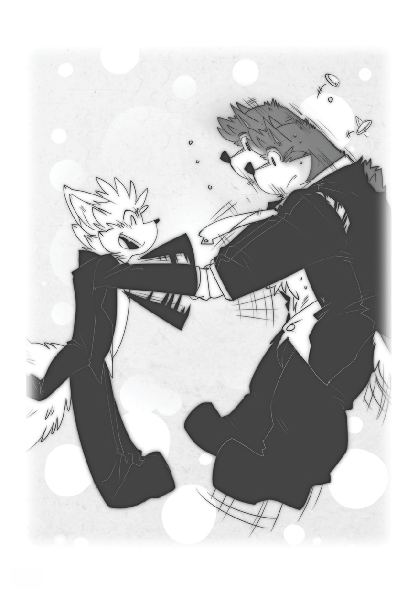

Wuffle watch him go out the door, and then rubbed his neck.

“I wonder what I said that made him so happy all of a sudden…?”

# Chapter 7

“General,” Foxxo called out, “how are you enjoying the pastries?”

“They are quite delicious, I’ll admit. You may not run a very tight ship around the house, but it would seem that you do a good job enough job managing the bakery.”

Foxxo smiled.

“Glad to hear it.”

The General gently wiped a few crumbs from his lips using a small handkerchief and looked at Foxxo. The young fox simply smiled at and said nothing. General Bacon’s gaze shifted to Wilhelmina, who was nervously sipping her soda, and darting her eyes between Foxxo and her employer. The sudden cheery silence unsettled the General somehow.

“Well then, shall we, er… get back to business?”

“Actually, General, I was wondering if we might discuss family.”

“Family!?” The General was taken off-guard. “That’s hardly appropriate for-“

“I believe you know my family.”

“Oh, yes, I know your parents, they’re very-“

“And I know your family, General!”

“Wha… my family!?” Wilhelmina’s eye followed each of them as they spoke. Something about this change in tone was very interesting to her. After all, it wasn’t often she saw anyone get the best of the General, even by a little.

“Some time ago I attended a holiday, and I met a fascinating a person. Your sister.”

Wilhelmina spat out her soda, and the General’s eyes nearly popped out of his head. He gestured to Wilhelmina to clean up the briefcase, which had absorbed the soda.

Foxxo motioned for them to stop, however, and called Wuffle, who was instructed to take it into the kitchen for a quick cleaning. As he left the sitting, Wuffle noted with a smile that Foxxo seemed to have control of the situation. Whatever he had suggested to his friend, he thought, it must’ve worked… even thought he still no idea what it was.

“So, you… you’ve met my sister.” The General tried to regain his composure. “I wasn’t that you… you were aware of her.”

“Oh, yes. She and I got along rather well.”

Foxxo smiled even wider.

“You… don’t say.”

“I do! And I seem to recall hearing that she has her own construction business, am I correct?”

The General gritted his teeth.

“Yes… yes, that’s correct. And I know you’re driving at. And, yes, she COULD have the mill built cheaper. But Mr. Foxxo, you would making quite a big mistake. Her timber company could never provide you with material possessing the strength and durability of my bricks. A watermill built by her company wouldn’t last you nearly as long as sturdy, brick building, and to maintain it, you’d pay more in the long run…”

“That may be true,” Foxxo replied calmly, “but I believe the additional income the mill will generate should more than cover the maintenance and repair costs. It should pay for itself.”

“I… I…”

“Besides, her company is ideal for providing the wood for the wheel. So we’ll already be doing business with her company. I’m sure she’d jump at the chance for a lucrative contrast, expanding her operation from building a watermill wheel, to a constructing the entire building and sharing a stake in the profits…”

“Fine!” The General bellowed. “Very well! I’ll take the 30 precent!”

“General, pardon me,” Foxxo spoke with a little too much innocence, “but given the potential deal I could make with your sister, I don’t think it would be in my, or the village’s best interest to offer 30 precent. It would have be the original 25.”

“You can’t seriously expect me…”

“Of course I’ll pay for the construction costs out of my own pocket, as we discussed.”

“To provide this many bricks for 25 precent of the business!” Foxxo reassure the General.

“You won’t!?” the boar asked with some hope in his voice.

“Certainly not. You, and all of your employees, will be receiving coupons for one free donut a day from the Gingerbread Bakery, good for the duration of the project.”

The General’s face froze. Wilhelmina eyes continued to dart between the two negotiators, noting the look of the triumph on Foxxo’s face. Finally, the General return to his earlier, stone-faced demeanor.”

“Very well, Mr. Foxxo. Very well. I can see that despite your eye, you certainly know a thing or two about business.”

“I appreciate the compliment, sir.”

“I suppose you’ll want to sign the contracts now.

The General spat the words out, as if they tasted sour.

“Certainly, though I would check over the blueprint and the building and build information. I owe it to the village to be thorough.”

“Wilhelmina, give him the building plans,” the General gestured to his assistant. The chameleon gathered up the approciate papers and handed them to Foxxo. He studied them, closely, making sure not to overlook a single detail. At last, he began to checking the final pages, the maps ad photos of the construction site.

“These are the exact location where the mill will be built?”

“Of course, of course…” replied the irritated General.

“This all looks good, then… wait…” Foxxo suddenly noticed something in the pictures that he hadn’t seen before. In one of the photos, there was a massive tree. The General noted with some confusion that Foxxo appeared to be hypnotized by it.

“Is there a problem, Mr. Foxxo?” the boar asked.

“This… this is where you’re building? Next to this oak tree?”

“Oh, yes… I’m afraid that will have to be torn down. Actually, perhaps the wood could be used for construction purposes.”

“Isn’t there another spot you could build the mill?”

“Our surveyors have determined that the ideal spot for the mill is one we’ve chosen. Anywhere else, we won’t be able to maximize the mill’s efficiency. It could potentially ruin the whole venture. As a stakeholder, of course, I must insist that we build in the most effective spot.”

“I’m sorry, Mr. Foxxo, but you can’t expect us to change our plans at this stage. The location has been decided, and the villagers approved of it. There was no objection.”

“But I really must insist, there has to be-“

“Mr. Foxxo! You’ve already had all of your demands met, and I’ve come away from this deal with substantially less than I had intended… there is absolutely no way this could be changed.”

Foxxo looked at the General, and it was clear that boar wasn’t going to budge. He looked once again at the picture, and a rush of memories went through his mind. It had been a long time since he’d seen that oak tree, he recalled. Once upon a time, though, he’d seen it every afternoon. It always filled him with a sense of safety, knowing it would be there, day after day. He couldn’t let that area be torn down. Just like the General, he wasn’t going to budge, either.

“Then I… I’m afraid we don’t have a deal. I’ll require a greater share. An additional 10 percent.”

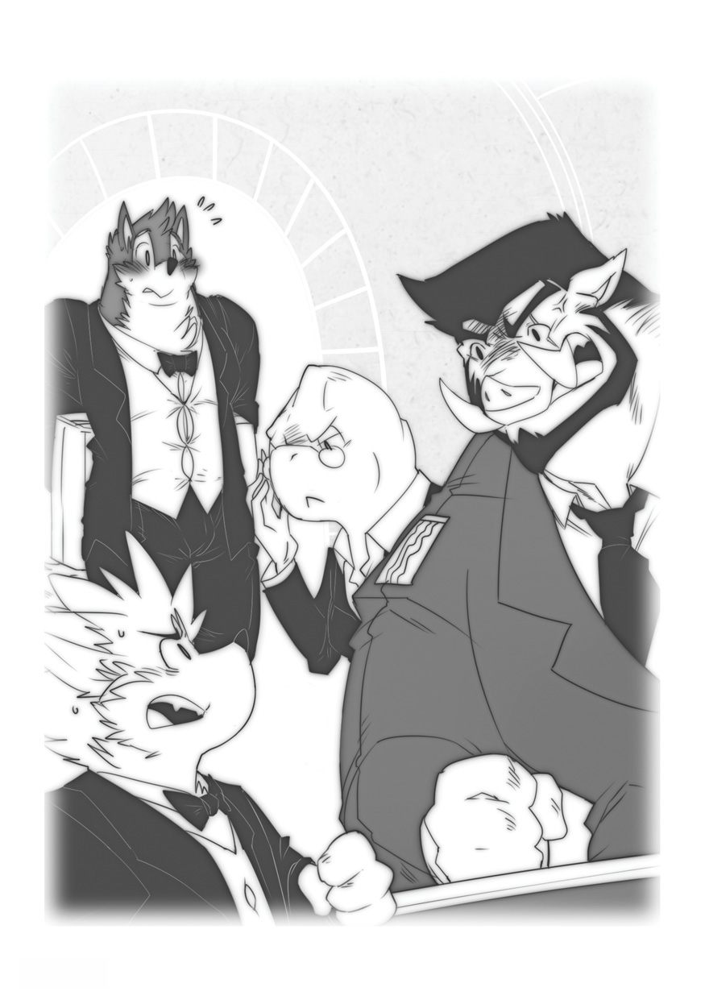

“WHAT!?”The General boomed. “Of all the impudent, insolent…!”

“Excuse me!” Wuffle’s voice suddenly cut in. “I tried my best to get all the soda out of this briefcase, but there might still be stuck in the…”

“HOW CAN YOU ASK ME GIVE UP ANOTHER **10** PERCENT!?”

“Wha… another 10 percent!?” Wuffle, shocked by the outburst, slipped on some of the cola that he had dripped onto the floor. He land on Wilhelmina’s lap. Despite being smaller than Wuffle, she somehow managed to carry him in her arms as she stood up, walked a short distance away from her chair, and dropped him with a loud thud on the floor. Without a word, she returned to her seat.

As he began to stand up, there was a loud rrrrrrip! His pants had split. Wuffle went red with embarrassment.

“Oh, dear…”

While he spoke, his tail finally poked out of the tear in his pants with a sporing!

“I guess I… need a tailor…” he grinned, embarrassed. He was doing his best to cover up the tear with the briefcase.

Foxxo and the General were too focused on their negation to notice any of this, however.

“I’m sorry, General, but those are my terms. Take it or leave it.”

The General’s eyes were wide and red, he was huffing and puffing, as if he were about to charge right at Foxxo. But then his breathing slowed down, even the look in his eyes didn’t change.

“Mr. Foxxo, I had come to believe that you were a better negotiator than I’d first assumed, that you were more mature than your age would indicate. However, I see that I was wrong. You’re nothing more than spoiled brat. My offer was most generous, and this… this is an insult. You may negotiate with my sister, if that is what you want. Not that even she is foolish to make a deal with someone like you. Our business here is finished. Best of luck to you. You’ll need it, when you have to explain to all of Gingerbread Village how you cost them one of the most lucrative development offers they’ve ever seen. Now, I must be going. Thank for the pastries. Good day.”

Foxxo flinched a little at the General’s harsh words, but kept his cool.

“Very well, General. I’m sorry that things didn’t work out. Good day.”

“Wilhelmina!” At his call, the chameleon snapped at the attention, gathered up the papers, and grabbed the briefcase from Wuffle. His big fluffy tail popped back into view once again.

“You…”

Wuffle gulped.

“You require more training.”

She continued her work without another word, leaving Wuffle frozen in place. After neatly organizing all the papers inside the briefcase, she snapped the case shut and began to carrying it to the door. As she walked, cola began leaking from inside it. The General noticed, rolled his eyes, and walked outside.

“What happened!?” Wuffle, totally lost, as Foxxo went to the window to watch his guests drive away. “Were’t you able to make a deal!? Couldn’t you convince him to take 30 percent?”

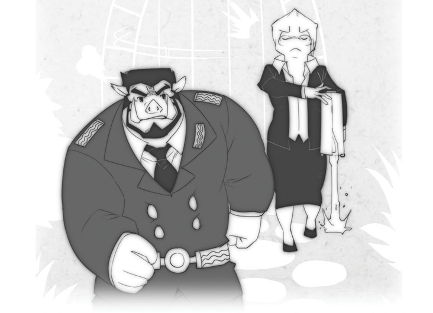

“I convinced him to take 25. It seem like we might have a deal after all, for a while. Foxxo sounded as if his thoughts were far away. “But we just couldn’t work it out.”

“I thought I heard you asking for an extra 10 percent.”

“That’s right…” Foxxo’s voice trailed off as he watched through as a General Bacon’s limousine disappeared down the street. Outside, the villagers excited by the prospect of the new mill, were also watching the stranger drive away. The village looked calm in the light.

“But Foxxo, you couldn’t really except him to take only 15 percent stakes, when he’s supply all those bricks!”

“That’s too bad…” suddenly, Foxxo began sounding like his old self again, as if waking from a trance, “that’s just too bad!” He turned to face Wuffle. “I made him an offer and he refused it! If I can’t get a percent share, than I’m certainly not paying a dime to build a dumb old mill! Besides, I could get a better deal on bricks somewhere else. I don’t want to work with that sour old boar anyway.”

Wuffle crossed his arms, worried. Something didn’t seem quite right to him.

“Foxxo… is there some other reason you didn’t take the General’s offer?”

“What other reason could there be1?” Foxxo asked. “I just wanted more money. That’s all.”

“It just… seems like you had something else on your mind.”

Foxxo turned up his nose.

“Hmph! What else could possibly be on my mind? This was a business negotiation, after all. Getting the best was the whole point.”

“I guess so, I just thought maybe… never mind. Sorry, Foxxo. I guess I’ll let myself out, as soon I change clothes…” He headed up to the guest room, disappointed that the meeting turned out so badly, both for the villagers and for Foxxo. He wished there was something he could make it better.

“Hey, Wuffle?” Foxxo’s voice had changed again. He sounded more serious than before, almost nervous.

“Yes?” Wuffle turned back to his friend.

“Do you… do you own anything that you’d never sell, no matter what?”

“Huh?”

“I mean, do you own something anything that’s… so special t you, you wouldn’t give it up for almost any price?”

“Sure. My sister drew a picture for me when we were kids. She’s never ben much of an artist, but she made for me, so it means a lot. I’ve always kept it with me. I doubt anyone would want to buy it anyway, though,” Wuffle chuckled.

“Imagine someone did. And then… imagine that if you sold it, it would make a lot people happy. Would you sell it?”

“No… I don’t think so.”

“You don’t think that’s… selfish?” Foxxo sounded almost guilty. Wuffle noticed, like something was weighing on his conscience.

“There are a lot of nice things you can do for people, to make them happy. But when you share something with somone you care about, or when someone share with you… you can’t replace it. It’s special. I don’t think that’ selfish at all. Like I said, you can find a million ways to make people happy. But some things are one-of-a-kind, and that’s okay to hang onto them.”

For the first time in a while, Foxxo really smiled.

“Thanks, Wuffle.”

Wuffle smiled back. He was still curious about what exactly he caused the meeting to turn out so badly, but for now, it seemed like Foxxo wanted to be so alone with his thoughts. He gave his friend a quick and headed back upstairs.

“It will be a nice to get out of this tight suit… I can barely breath in this thing. All day it felt it’s going to explo-“

_Rrrrrriiiiip!_

As he reached for the first step of the staircase, the suit exploded. With only tattered remains of his already ripped pants, Wuffle blushed and began to creeping his way upstairs.

“Oh great,” murmured Foxxo, once again his old self, “what a grand finale for this day…”

# Chapter 8

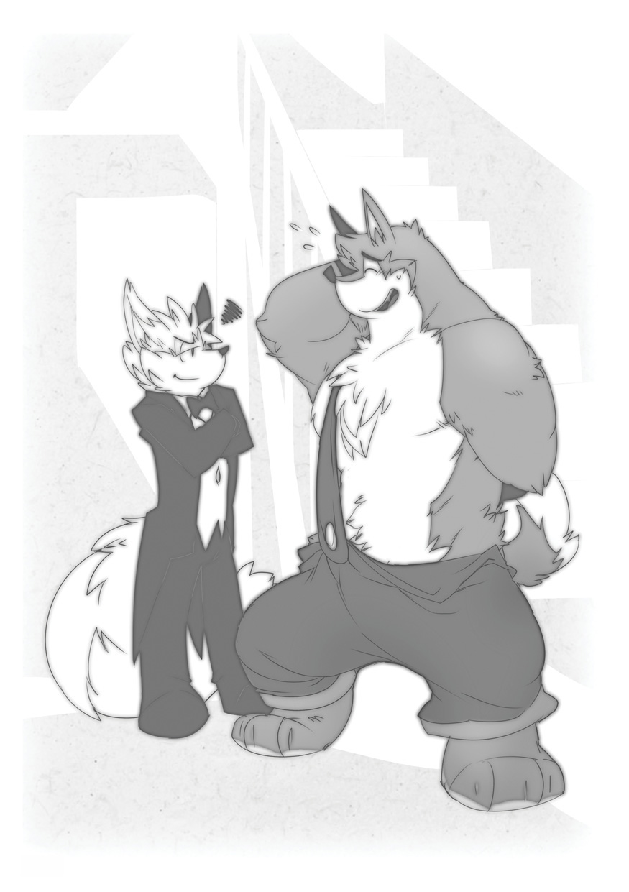

Moments later, Wuffle was back down the stairs in his overalls.

“Sorry again that things didn’t turn out well… and sorry I wasn’t better butler.”

“That reminds me!” Foxxo exclaimed. “You did serve as my butler for the day, so I owe a day’s wages! But I’m afraid I’ll have to take the expenses for the suit out of your paycheck.” He grinned. Wuffle smiled back.

“You’re a tough negotiator, Foxxo!”

“Tough but fair! You still deserve something for helping me today…” He ran into the kitchen and handed Wuffle a cookie.

“Hmm, thanks! See ya later, Foxxo! Err… I mean… Mister Foxxo!”

As Wuffle walked down the street back to his, he was still wondering about Foxxo’s strange behavior. Sure, Foxxo could be greedy sometimes, Wuffle knew that. But he also knew that underneath that greedy, tough guy routine, Foxxo really cared about his friends and about Gingerbread Village. It must’ve been something really important for him to give up a chance to make such a great, Wuffle though.

As he pondered it while walking through the last rays of the sunlight, he found his friends gather around ahead of him.

“So!?” asked Pui Pui eagerly. “Did they make a deal!?”

“Is the bakery going to double their donut production!?” asked Debbita, looking hungrier than ever.

“With all the money this will bring in,” said Aunty Pinky, “why, who knows what else we could build here in Gingerbread Village!”

“So, tell us!” demanded Maggie.

“Yeah! Did Foxxo make a great for the village?” asked Almond.

“I’m… really sorry, everyone…” Wuffle’s ears drooped. “But… things… didn’t work out.”

“WHAT!?” Pui Pui’s voice rose louder than everyone’s as all the villagers expressed their disbelief and disappointment. Wuffle raised his hands to calm the crowd.

Just as he began to storm towards Foxxo’s yard, Wuffle put a hand on his shoulder.

“Pui Pui, everyone, listen… I know Foxxo seems greedy… and, yeah, sometimes he can be really selfish, but… he’s still our friend. And I don’t really believe he’d do something like this without a good reason.”

“A good reason!?” Matilda chimed in. “What reason could have to demand more money!? How can that be anything but selfish?”

“I know it looks bad. I was upset too, at first. But something tells me that this is one of those times when we just have to trust Foxxo. He might have always do the right thing, but I know cares about us. I’m sure he’ll find another way to help the village grow. Maybe this wasn’t the right project. And maybe General Bacon wasn’t the right person to do business with.”

Pui Pui crossed his arms and leaned against a fence, frowing.

“Maybe, but I still don’t like it. And I don’t see HOW he could have a good reason to ask for more money.”

“I don’t think it was about the money.”

Pui Pui stick his tongue out.

“With Foxxo, it’s ALWAYS bout money!”

“That’s what he like us to think. But he’s under a lot of pressure. His family has high exceptions for him. He feels like he always has to be the best.”

“It does seem like he’s stressed out a lot…” Debbita mused.

“Of course. He doesn’t want to feel like a failure. We need to be there for him, and show him that we care about him no matter what happens.”

“Wuffle’s right,” said Aunty Pinky, “all of us have family and friends close by. Poor Foxxo is all alone in that big mansion of his, except for Joe keeping him company.”

“We should all invite Foxxo to hang out with us!” Maggie suggested enthusiastically. Wuffle grinned.

“That’s a great idea! But maybe we should wait a while. Foxxo’s had a tough day. I’m sure he’ll want to be alone this evening… how about we have a cookout tomorrow?”

“Yeah!” everyone cheered.

“For now, though, let’s have some dinner at my place Pui Pui caught some great fish today. I’ll cook!”

Though Pui Pui wasn’t the only one who was unsatisfied with the way things had turned, everyone trusted Wuffle. If he said that they ought to give Foxxo the benefit the doubt, they willing to at least put aside their disappointment and wait to deal with the problem another day. And right now, the prospect of a dinner seemed like a more urgent concern anyway.

As they walked together down the road, each lost in their own thoughts, Debbita broke the silence.

“Hey!”

“What is it, Deb?” asked Wuffle.

“That guy’s name was General K. Bacon, right?”

“Well, I was wondering just wondering. What does the K stand for? Anyone know?”

Everyone looked around at one another, and at first it seemed as if nobody knew the answer.

“I bet it’s Krusher,” said Maggie. “It has to be a tough name like that.

“I think it’s probably Krash,” said Matilda. “He looks like a Krash.

“Maybe it’s Kruel,” said Chuck.

“Or maybe… Kalamity,” said Almond.

Then Aunty Pinky spoke up.

“I know his first name.”

“Oh? What is it, Aunty Pinky?” Wuffle asked her.

“Kevin.”

Wuffle fell over, and everyone else tripped on him and tumbled like dominos.

# Chapter 9

Back in his room, Foxxo watched his friends make their way down the road. He didn’t look forward to facing them, but from what he could see, it seemed like Wuffle had calmed everyone down. In time, he thought, everything would blow over. Of course, he’d have to think of a new plan to help Gingerbread Village, something that could replace the mill project to help the village grow. But for now, he thought it would be best to relax and enjoy quiet country evening.

As he turned around, about to take a much needed rest his bed, he saw Joe standing in the hallway, knocking on the half-open door.

“Excuse me, young master, do you need anything?

“Joe!” Foxxo couldn’t contain his relief at seeing his butler again, before remembering how Joe had suddenly disappeared when he’d need him most. “WHERE HAVE YOU BEEN!?”

“I took a vacation day. Did you get my note?”

“Yes, I read your note. Next time, give me some warning before you do that! Do you know what kind of situation you put me? I had to call Wuffle to fill in as my butler for the day! What a disaster!”

“I do apologize, young master. It won’t happen again,” Jo couldn’t help but smile a bit at the thought of Wuffle trying to serve as a butler. He could only imagine how the must have managed all day.

“See that it doesn’t! What got into you, anyway?”

“I just felt that… I wouldn’t be of help to you today.”

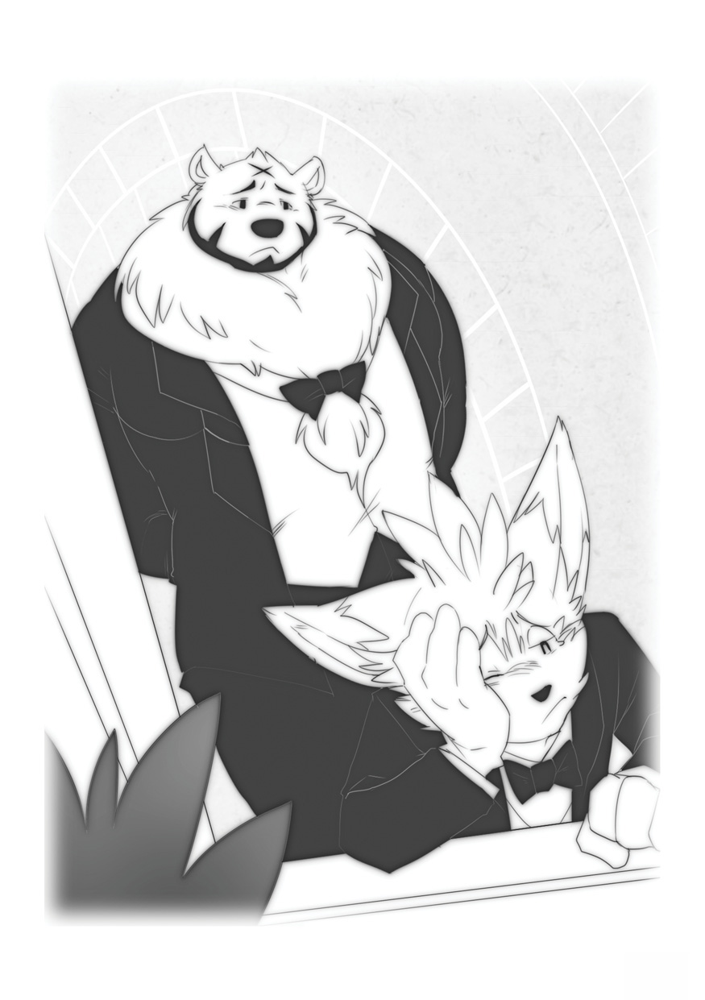

Foxxo sighed.

“Whatever.”

“So, may I ask, how did the meeting go?”

“Awful. We couldn’t come to an agreement.”

“I’m sorry to hear that. May I ask why?”

“He… wasn’t willing to pay what I asked. I demanded a 60 percent share, he demanded 25, and the village asked 25 as well, so it didn’t work.”

“That is… unfortunate. By the way, I found some papers left on the floor by the sofa. Your guest must’ve dropped them.”

Joe handed some papers to Foxxo. They continued the highlighted section of the map, where the mill was mill was supposed to be built, and the pictures of the spot, showing the big oak tree by the river.

“Did you… did you look at these, Joe?”

“I did catch a glimpse of them.”

Foxxo became very silent and stared at his feet.

“I’m honored that you still remember,” Joe spoke with an unusual gentle tone in his rough voice, “and I just as I knew you would… did the right thing.”

Foxxo smiled up at Joe.

“There was just no way I could’v let them tear down that tree, or clear that part of the forest. Even if the whole project was nature-friendly, somethings just… can’t be replaced.”

“You did spend a great deal of your childhood there.”

“It’s not just because that place reminds me being a kid. It’s… it’s just that, growing up, everything was always handed to me. Nobody ever thought I could do anything on my own. My parents meant well, but I never felt like they really believed in me. But then… in that forest, for the first time… I really felt like I could take care of myself. Even after all the trouble I got into, and needing so much help, I still felt so much better knowing that somebody believed in me for once. No matter how much I messed up.”

“Mistakes are stepping stones, learning, young master…” Joe mused.

“I guess so. But I’d never have learned that if I wasn’t for you. And I’d never have met you if it hadn’t been for that tree and that river…”

To everyone else, Joe might seemed like a butler and nothing else, butFoxxo knew that beneath all that formal language and protocol, Joe was one of the best friends he could ever ask for.

“The forest is a great teacher. I know this as well as you.”

“Could we… I mean, would like to visit there again soon?”

“I’m surprised that you would want to go back, sir. I thought you would feel too grown up for such things.”

Joe’s voice sounded almost sad.

“Of course not! There’s nothing wrong revisiting old days once in a while, is there? You should never get so grown up that you forget where you came from, right?”

Joe smiled.

“I supposed not, young master. We can make a little trip out to the river tomorrow, you’ll have some free time in the afternoon. But it’s getting rather late,” Joe changed the subject, “we’re behind schedule for dinner time.”

“Yes! I’m so hungry!”

As Foxxo and Joe went downstairs to the kitchen, they heard the doorbell ring. Foxxo’s heart sank… it was probably one of his friends, there to complain about losing out n the mill he thought. Luckily, though, now that Joe was back, he couldn’t have to face them alone.

Joe was at the door in a flash. as he opened it up, his usually face was replaced by an expression of total shock.

“Why, hell there, Joe,” said the General.

“Hello… General,” Joe replied uneasily.

“You… you two know each other!?” asked Foxxo, following Joe to the door.

“You might say that,” the General replied with a smile. Joe appeared frozen in place.

“Pardon me General, but why are you back? I thought we’d finished our business.”

“I’m afraid I forgot some papers. And you seem to have them in your hands.”

Foxxo stared at the papers, with the pictures of the oak tree and building site, still in his grasp. He looked up at the General and grinned sheepishly. As he handed them back, the General spoke again, this time with an unexpectedly calm, reassuring tone.

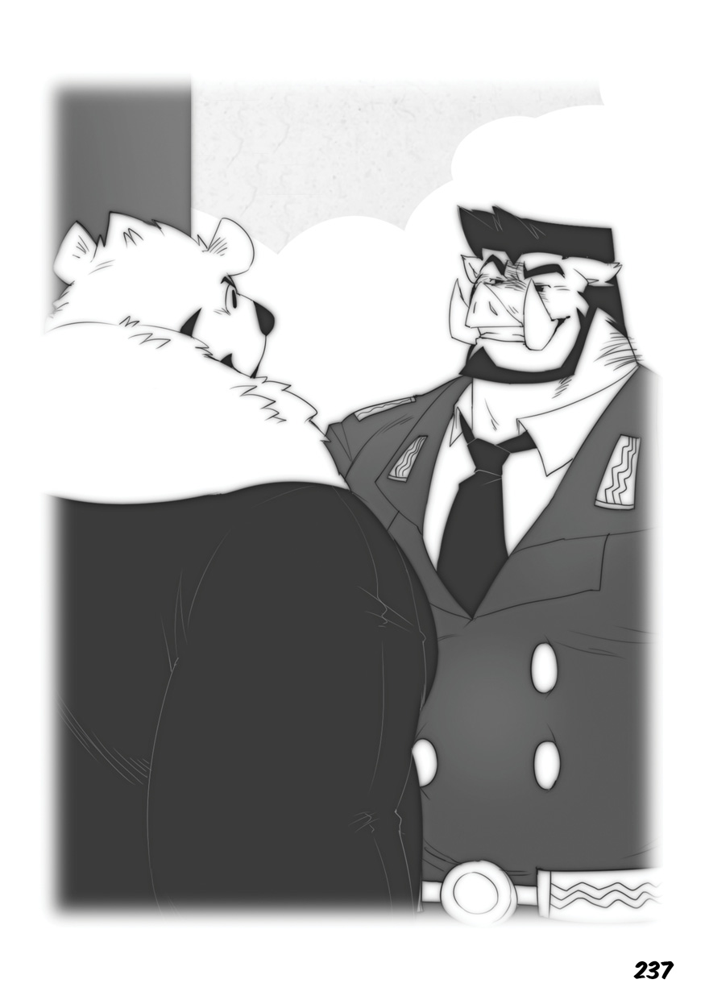

“Mr. Foxxo, I fear perhaps I may have been a bit… short-tempered, earlier. You are young and ambitious, after all. I was that was that myself once. I can’t fault you for it, even if it does lead one to make the odd mistakes now and then. One might even say that such over-eagerness and ambitious are noble traits, in their way…”

“Forgive me, General, but what is it you’re trying to say?”

“I’m willing to make a concession. I’ll as low as 20 percent. Do we have a deal?”

“I asked for 15 percent, General Bacon. Those are my terms.

General Bacon’s face became strained again, like before. His eyes began to look red.

“You… you drive a VERY hard bargain, Mr. Foxxo. Fine, I’ll take 15 percent.”

Foxxo stared at the General, unable to believe his own ears.

“Did you… did you just you’ll take 15 percent?”

“Don’t… Don’t rub it in!” the General snapped back. “Do we have a deal!?”

“I… I…” Foxxo looked up, and saw Joe’s eyes suddenly on him. “I’m sorry, General. I’m very sorry. But no.”

“WHAT!? How can possibly say no to that? After I’ve conceded nearly my entire in the venture? Waht else can you possibly ask for? 70 percent? 75? What more could you want? Free bricks? Free construction!? Mr. Foxxo, it would be a grave insult for you to turn down this deal after I’ve agreed to concede such a part of my-“

“General,” Joe steely voice suddenly cut in, “young master said no. It’s his dinner time, so I’m afraid I must ask you to leave.”

General Bacon stared at Joe. Their eyes locked, both were nearly the same height, and from Foxxo’s perspective it was if two giants were about to do battle. Finally, General gave a quick, curt nod, turned around, and headed for his limousine.

“Goodnight, gentlemen,” he said as he turned away. Within a moment he was in his car and Wilhelmina was driving away once more.

“Wha… what was that all about? You know him?” asked Foxxo.

“It’s very late. You need to eat your dinner soon, young master.” And without another word, Joe was on his way to the kitchen.

Foxxo stood in the doorway, alone, and wondered. He was no stranger to keeping secrets. Being a bit sneaky was in his nature. There couldn’t always be something his friends, even Wuffle, didn’t know about him. But it never occurred to him before how much he didn’t know about his friends… even Joe.

As the dust on the road settled, and the limousine disappeared into the sunset, Foxxo snapped back to the present and when he detected the scent of stew cooking. He joined Joe in the kitchen, where his loyal butler was busy preparing their evening meal. The scent was making his mouth water.

“Can I help?” he asked quietly. Joe turned to him, surprised.

“You… want to help me cook, young master?”

“Do you mind?”

“No, not at all…” Joe was obviously having a hard time believing what he was hearing.

“What’s the matter?”

“It’s quite unlike you, young master. You rarely show interest in domestic duties. Don’t you feel that it is work best suited to servants?”

“Yeah… I guess I do feel that way… usually. But today, I feel like maybe I’d better learn some skills in others areas besides business. It’s not like there’s anything wrong with being a butler, anyway. It’s honest work. One of my best friends in the world is a butler.”

Foxxo smiled.

“I appreciate the sentiment, master Foxxo,” Joe replied with a hint of satisfaction in his voice.

“And I appreciate all you do for me, too. I know I’m not always easy to work for, and I’m sorry if sometimes it seems like I’m not grateful for all the you…”

“No need to say any more. Joe put a hand on Foxxo’s shoulder. “You can be… difficult, but there’s much more to you than meets the eye. Today may not have gone as planned, but you acted with judgment and principle. That’s something to be proud of. I’m certainly proud of you.”

Joe turned back to his stew, as Foxxo tried to hide a tear in his eye. He pretended it was from a chopped onion on the counter next to him.

“You will have other negotiators. You’ll have more failures, and more successes. Don’t let yourself be discouraged.”

Moment passed in silence as he stirred the pot.

“Of course,” he continued, “there are always more things to learn. You did an excellent job growing tomatoes some time ago. Now would be an excellent to learn to cook them. There are a few in the bottom drawer of the refrigerator.”

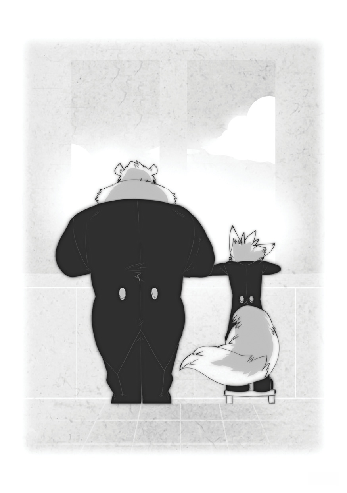

# Uncopyright

Copyright pages exist to tell you that you can’t do something. Unlike them, this Uncopyright page exists to tell you that the writing and artwork in this ebook are believed to be in the United States public domain; that is, they are believed to be free of copyright restrictions in the United States. The United States public domain represents our collective cultural heritage, and items in it are free for anyone in the United States to do almost anything at all with, without having to get permission.

Copyright laws are different all over the world, and the source text or artwork in this ebook may still be copyrighted in other countries. If you’re not located in the United States, you must check your local laws before using this ebook. Standard Ebooks makes no representations regarding the copyright status of the source text or artwork in this ebook in any country other than the United States.

Non-authorship activities performed on items that are in the public domain—so-called “sweat of the brow” work—don’t create a new copyright. That means that nobody can claim a new copyright on an item that is in the public domain for, among other things, work like digitization, markup, or typography. Regardless, the contributors to this ebook release their contributions under the terms in the CC0 1.0 Universal Public Domain Dedication, thus dedicating to the worldwide public domain all of the work they’ve done on this ebook, including but not limited to metadata, the title page, imprint, colophon, this Uncopyright, and any changes or enhancements to, or markup on, the original text and artwork. This dedication doesn’t change the copyright status of the source text or artwork. We make this dedication in the interest of enriching our global cultural heritage, to promote free and libre culture around the world, and to give back to the unrestricted culture that has given all of us so much.

# Legal Code

CREATIVE COMMONS CORPORATION IS NOT A LAW FIRM AND DOES NOT PROVIDE LEGAL SERVICES. DISTRIBUTION OF THIS DOCUMENT DOES NOT CREATE AN ATTORNEY-CLIENT RELATIONSHIP. CREATIVE COMMONS PROVIDES THIS INFORMATION ON AN "AS-IS" BASIS. CREATIVE COMMONS MAKES NO WARRANTIES REGARDING THE USE OF THIS DOCUMENT OR THE INFORMATION OR WORKS PROVIDED HEREUNDER, AND DISCLAIMS LIABILITY FOR DAMAGES RESULTING FROM THE USE OF THIS DOCUMENT OR THE INFORMATION OR WORKS PROVIDED HEREUNDER.

## Statement of Purpose

The laws of most jurisdictions throughout the world automatically confer exclusive Copyright and Related Rights (defined below) upon the creator and subsequent owner(s) (each and all, an "owner") of an original work of authorship and/or a database (each, a "Work").

Certain owners wish to permanently relinquish those rights to a Work for the purpose of contributing to a commons of creative, cultural and scientific works ("Commons") that the public can reliably and without fear of later claims of infringement build upon, modify, incorporate in other works, reuse and redistribute as freely as possible in any form whatsoever and for any purposes, including without limitation commercial purposes. These owners may contribute to the Commons to promote the ideal of a free culture and the further production of creative, cultural and scientific works, or to gain reputation or greater distribution for their Work in part through the use and efforts of others.

For these and/or other purposes and motivations, and without any expectation of additional consideration or compensation, the person associating CC0 with a Work (the "Affirmer"), to the extent that he or she is an owner of Copyright and Related Rights in the Work, voluntarily elects to apply CC0 to the Work and publicly distribute the Work under its terms, with knowledge of his or her Copyright and Related Rights in the Work and the meaning and intended legal effect of CC0 on those rights.

1. **Copyright and Related Rights.** A Work made available under CC0 may be protected by copyright and related or neighboring rights ("Copyright and Related Rights"). Copyright and Related Rights include, but are not limited to, the following:
   
   i. the right to reproduce, adapt, distribute, perform, display, communicate, and translate a Work;
   
   ii. moral rights retained by the original author(s) and/or performer(s);
   
   iii. publicity and privacy rights pertaining to a person's image or likeness depicted in a Work;
   
   iv. rights protecting against unfair competition in regards to a Work, subject to the limitations in paragraph 4(a), below;
   
   v. rights protecting the extraction, dissemination, use and reuse of data in a Work;
   
   vi. database rights (such as those arising under Directive 96/9/EC of the European Parliament and of the Council of 11 March 1996 on the legal protection of databases, and under any national implementation thereof, including any amended or successor version of such directive); and
   
   vii. other similar, equivalent or corresponding rights throughout the world based on applicable law or treaty, and any national implementations thereof.

2. **Waiver.** To the greatest extent permitted by, but not in contravention of, applicable law, Affirmer hereby overtly, fully, permanently, irrevocably and unconditionally waives, abandons, and surrenders all of Affirmer's Copyright and Related Rights and associated claims and causes of action, whether now known or unknown (including existing as well as future claims and causes of action), in the Work (i) in all territories worldwide, (ii) for the maximum duration provided by applicable law or treaty (including future time extensions), (iii) in any current or future medium and for any number of copies, and (iv) for any purpose whatsoever, including without limitation commercial, advertising or promotional purposes (the "Waiver"). Affirmer makes the Waiver for the benefit of each member of the public at large and to the detriment of Affirmer's heirs and successors, fully intending that such Waiver shall not be subject to revocation, rescission, cancellation, termination, or any other legal or equitable action to disrupt the quiet enjoyment of the Work by the public as contemplated by Affirmer's express Statement of Purpose.

3. **Public License Fallback.** Should any part of the Waiver for any reason be judged legally invalid or ineffective under applicable law, then the Waiver shall be preserved to the maximum extent permitted taking into account Affirmer's express Statement of Purpose. In addition, to the extent the Waiver is so judged Affirmer hereby grants to each affected person a royalty-free, non transferable, non sublicensable, non exclusive, irrevocable and unconditional license to exercise Affirmer's Copyright and Related Rights in the Work (i) in all territories worldwide, (ii) for the maximum duration provided by applicable law or treaty (including future time extensions), (iii) in any current or future medium and for any number of copies, and (iv) for any purpose whatsoever, including without limitation commercial, advertising or promotional purposes (the "License"). The License shall be deemed effective as of the date CC0 was applied by Affirmer to the Work. Should any part of the License for any reason be judged legally invalid or ineffective under applicable law, such partial invalidity or ineffectiveness shall not invalidate the remainder of the License, and in such case Affirmer hereby affirms that he or she will not (i) exercise any of his or her remaining Copyright and Related Rights in the Work or (ii) assert any associated claims and causes of action with respect to the Work, in either case contrary to Affirmer's express Statement of Purpose.

4. **Limitations and Disclaimers.**
   
   a. No trademark or patent rights held by Affirmer are waived, abandoned, surrendered, licensed or otherwise affected by this document.
   
   b. Affirmer offers the Work as-is and makes no representations or warranties of any kind concerning the Work, express, implied, statutory or otherwise, including without limitation warranties of title, merchantability, fitness for a particular purpose, non infringement, or the absence of latent or other defects, accuracy, or the present or absence of errors, whether or not discoverable, all to the greatest extent permissible under applicable law.
   
   c. Affirmer disclaims responsibility for clearing rights of other persons that may apply to the Work or any use thereof, including without limitation any person's Copyright and Related Rights in the Work. Further, Affirmer disclaims responsibility for obtaining any necessary consents, permissions or other rights required for any use of the Work.
   
   d. Affirmer understands and acknowledges that Creative Commons is not a party to this document and has no duty or obligation with respect to this CC0 or use of the Work.
